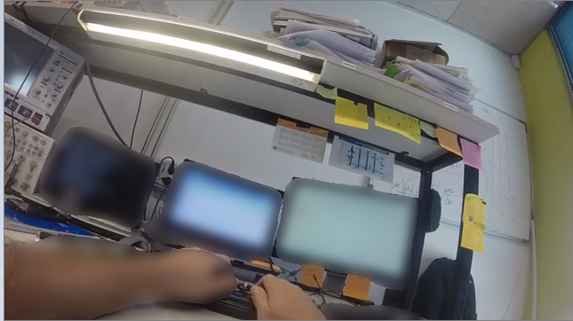

# Privacy_Protection based on Mask_RCNN

This is an implementation of [Mask R-CNN](https://arxiv.org/abs/1703.06870) on Python 3, Keras, and TensorFlow.Privacy is protected by detecting sensitive objects and segmenting those from video.The model generates bounding boxes and segmentation masks for each instance of an object in the image. It's based on Feature Pyramid Network (FPN) and a ResNet101 backbone.



The repository includes:
* Source code of Mask R-CNN built on FPN and ResNet101.
* Jupyter notebooks to visualize the detection pipeline at every step
* ParallelModel class for multi-GPU training
* Evaluation on MS COCO metrics (AP)
* Source code for Instance Segmentation in a Video
* Source code for Privacy protection for single image
* Source code for Privacy protection in a video


##VERY VERY IMPORTANT##
## Installation
1. Clone this repository
2. Install dependencies
   ```bash
   pip3 install -r requirements.txt
   ```
3. Run setup from the repository root directory
    ```bash
    python3 setup.py install
    ``` 
3. Download pre-trained COCO weights (mask_rcnn_coco.h5) from the [releases page](https://github.com/matterport/Mask_RCNN/releases).Download it from Mask R-CNN 2.0 -> assets -> mask_rcnn_coco.h5

4. (Optional) To train or test on MS COCO install `pycocotools` from one of these repos. They are forks of the original pycocotools with fixes for Python3 and Windows (the official repo doesn't seem to be active anymore).
* Linux: https://github.com/waleedka/coco
* Windows: https://github.com/philferriere/cocoapi.
You must have the Visual C++ 2015 build tools on your path (see the repo for additional details)

You can follow [Mask_RCNN_Dependencies Installation](https://www.youtube.com/watch?v=2TikTv6PWDw&t=689s) to install every dependency required for this project. 


# Getting Started
* [visualize_cv2.ipynb](visualize_cv2.ipynb) Is the easiest way to start.It's an example of using a model pre-trained on MS COCO to segment objects in your own video(You should change the working directory of input image in code.For instance,a line in code  capture = cv2.VideoCapture('working_directory\video name.file type') is desired.You should also change directory in every code in this repo)

* [demo+BlurredImage.ipynb](demo+BlurredImage.ipynb) It shows an example of using a model pre-trained on MS COCO to segment objects in your own images first and then it blur those sensitive images to provide privacy. 
It includes code to run object detection and instance segmentation on arbitrary images.

* ([model.py](model.py), [utils.py](utils.py), [config.py](config.py),[coco.py](coco.py)): These files contain the main Mask RCNN implementation.(Must keep these in the directory of main code) 

* [Privacy_Protected.ipynb](Privacy_Protected.ipynb) The main source code of our repository.It is the outcome of some modifications on Mask_RCNN.After instance segmentation we are able to detect sensitive objects in video and blur for privacy.Care should be taken as privacy is the main concern.You can observe the level of privacy protection whether it is noticable,distracting,disturbing or not.2 videos are provided to check its performance.We use these video as dataset as it was provided by IEEESPS for VIP Cup 2019.

* [Privacy_Protected_Save.ipynb](Privacy_Protected_Save.ipynb) This is the source code to make this task portable.A privacy protected MP4 video can be generated by it from a specific input folder containing multiple videos to a output folder.


## Requirements
Python 3.4, TensorFlow 1.3, Keras 2.0.8,opencv and other common packages listed in `requirements.txt`.

### MS COCO Requirements:
To train or test on MS COCO, you'll also need:
*** pycocotools (installation instructions below)
* [MS COCO Dataset](http://cocodataset.org/#home)
* Download the 5K [minival](https://dl.dropboxusercontent.com/s/o43o90bna78omob/instances_minival2014.json.zip?dl=0)
  and the 35K [validation-minus-minival](https://dl.dropboxusercontent.com/s/s3tw5zcg7395368/instances_valminusminival2014.json.zip?dl=0)
  subsets. More details in the original [Faster R-CNN implementation](https://github.com/rbgirshick/py-faster-rcnn/blob/master/data/README.md).

If you use Docker, the code has been verified to work on
[this Docker container](https://hub.docker.com/r/waleedka/modern-deep-learning/).


## Acknowledgement 
Tons of code was downloaded from theirs repo
https://github.com/matterport/Mask_RCNN
https://github.com/michaelnation26/sunglasses_of_invisibility.git

    
